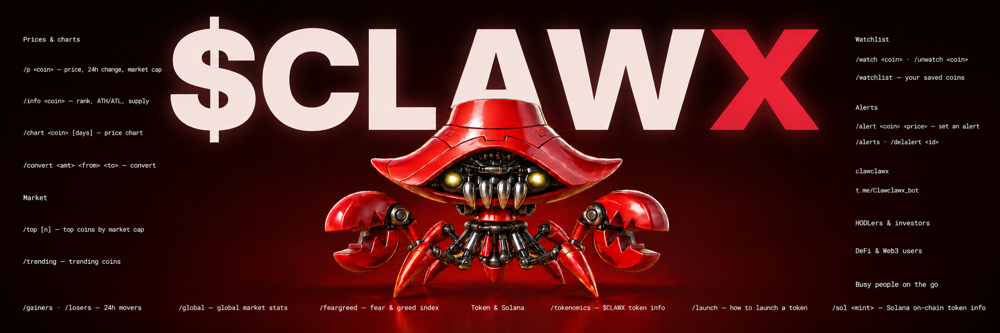
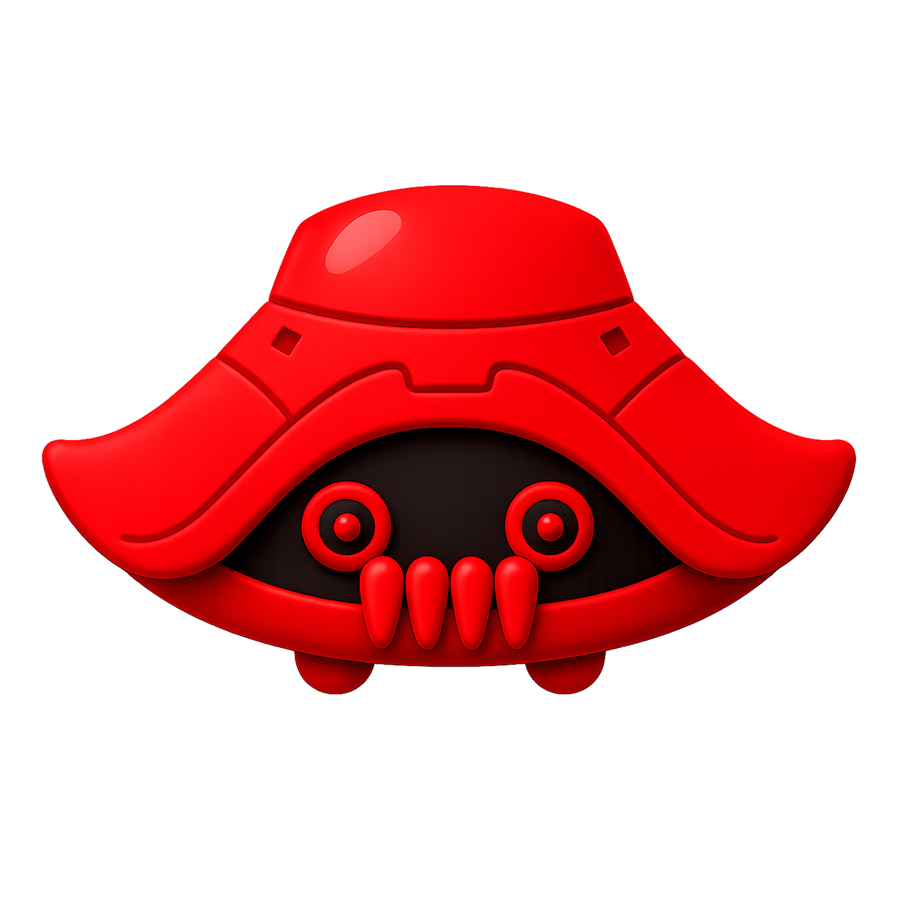

<p align="center">
  
</p>

<p align="center">
  
</p>

# CLAWCLAWX 🦞

**Your crypto intelligence agent on Telegram.** Real-time prices, charts, market data, trending coins, Fear & Greed and custom price alerts — free, no sign-up.

- 🌐 Website: **[clawclawxbot.xyz](https://clawclawxbot.xyz)**
- 🤖 Bot: **[@Clawclawx_bot](https://t.me/Clawclawx_bot)**
- 🪙 Token: **$CLAWX** (Solana)

> ℹ️ Information & education only — **not financial advice**. The bot never holds funds, keys or places trades.

---

## 🖼️ Preview

<p align="center">
  
</p>

## 📁 Project structure

```
.
├── index.html          # landing page
├── docs.html           # bot documentation
├── governance.html     # $CLAWX governance
├── styles.css          # dark / red glassmorphism theme
├── script.js           # scroll reveal, countdown, typewriter, marquee
├── assets/             # images (logo, mascot, section art)
└── bot/                # Telegram bot (Python)
    ├── bot.py
    ├── requirements.txt
    ├── .env.example    # copy to .env and fill in secrets
    ├── setup.sh        # one-shot VPS setup (deps + systemd)
    └── clawclawx-bot.service
```

## 🌐 Website
Plain static HTML/CSS/JS — host anywhere. Currently served on shared hosting at `clawclawxbot.xyz`.

## 🤖 Bot — quick start

```bash
cd bot
python3 -m venv .venv
./.venv/bin/pip install -r requirements.txt
cp .env.example .env        # then edit .env and add your BOT_TOKEN
./.venv/bin/python bot.py
```

Create your bot token with [@BotFather](https://t.me/BotFather). Crypto data comes from the free [CoinGecko API](https://www.coingecko.com/en/api); on-chain Solana data uses [Helius](https://helius.dev) (optional).

### Commands
`/p` `/info` `/chart` `/convert` · `/top` `/trending` `/gainers` `/losers` `/global` `/feargreed` · `/tokenomics` `/launch` `/sol` · `/watch` `/unwatch` `/watchlist` · `/alert` `/alerts` `/delalert`

## ☁️ Deploy (24/7)
Runs on a Linux VPS via `systemd`. On the server:
```bash
cd ~/clawclawx-bot && bash setup.sh   # installs deps + service
nano .env                              # add BOT_TOKEN
sudo systemctl restart clawclawx-bot
```
Only **one** polling instance may run at a time (otherwise Telegram returns `409 Conflict`).

## 🧩 Ecosystem
OpenClaw · MoltBook · ClawdBot · Anthropic Claude · AWS · Solana · Helius · CoinGecko · Telegram · python-telegram-bot

## ⚠️ Security
Never commit `bot/.env` (it holds your bot token & API keys) — it is git-ignored. Rotate keys if they are ever exposed.
